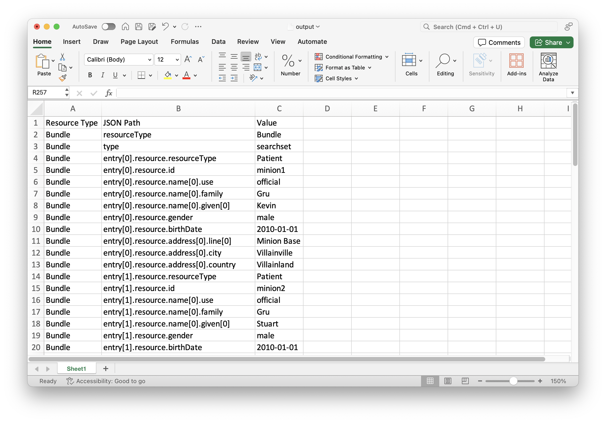

# fhir2excel

A simple Node.js script to flatten FHIR JSON data and export it as an Excel file. This program is designed for inspecting FHIR data by extracting resource, JSON path, and value information in a tabular format.

## How to Use

First, you need to install the dependencies:

```
npm install
```

To run the script, use the following command in your terminal:

```
node fhir2excel.js <input-file> <output-file>
```

## Example Output


